class: middle, center, title-slide
count: false

# Overview of Publishing Statistical Models

.huge.blue[Matthew Feickert] 
.large[(University of Wisconsin-Madison)]
 
[matthew.feickert@cern.ch](mailto:matthew.feickert@cern.ch)

[Reinterpretation Forum Workshop 2022](https://indico.cern.ch/event/1197680/contributions/5160805/)
 
December 13th, 2022

---
# Starting with the important information

.center.large.bold[Start publishing (full) statistical models]

.kol-1-2.large[

.center.width-100[[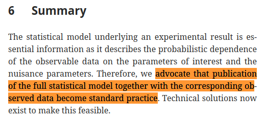](https://inspirehep.net/literature/1919763)]
<!-- .center.width-100[[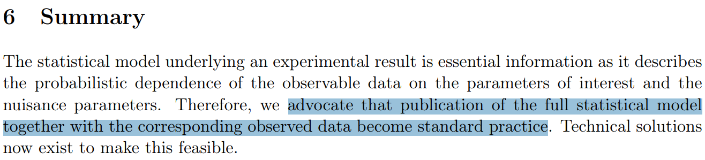](https://inspirehep.net/literature/1919763)] -->

.center.large[[Publishing statistical models: Getting the most out of particle physics experiments](https://inspirehep.net/literature/1919763)]
]
.kol-1-2[

.center.width-100[[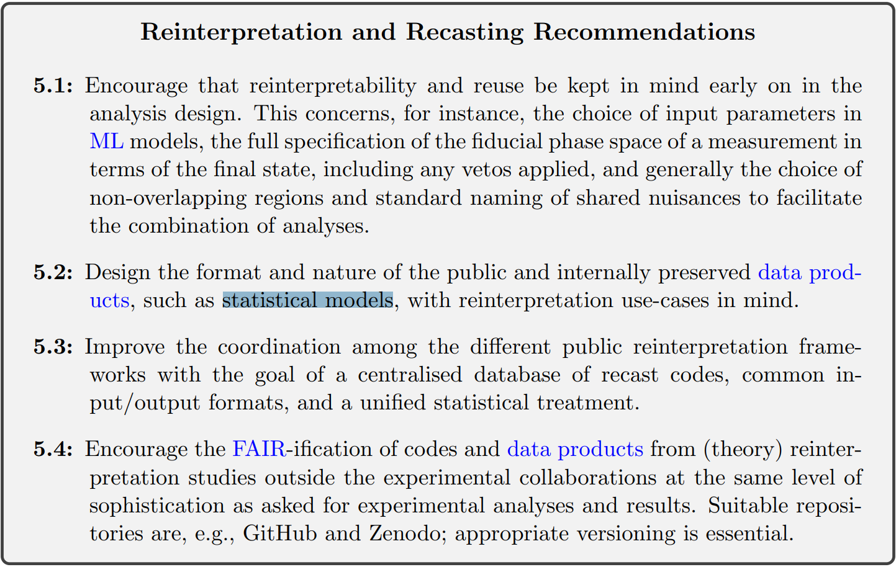](https://inspirehep.net/literature/2054747)]

.center[[Data and Analysis Preservation, Recasting, and Reinterpretation](https://inspirehep.net/literature/2054747) (Snowmass 2022 whitepaper)]
.center[[Reinterpretation and Long-Term Preservation of Data and Code](https://inspirehep.net/literature/2153139) (Snowmass 2022 recommendations)]
]

---
# Why is the full statistical model important?

.kol-1-2.large[
- High information-density summary of analysis
- Almost everything we do in the analysis ultimately affects the likelihood function from the statistical model and is encapsulated in it
   - Trigger
   - Detector
   - Systematic Uncertainties
   - Event Selection
- Unique representation of the analysis to preserve
]
.kol-1-2.large[
.gray[When considering down-stream functionality, the .bold[full statistical model] together with the corresponding data are the .bold[gold standard] as they .bold[enable combinations, reinterpretations, and the generation of synthetic or pseudo data] ("toy Monte Carlo") that are typically needed for frequentist procedures (see e.g. Section 4.2.2), or for validating statistical procedures.]

.center.large[[Publishing statistical models: Getting the most out of particle physics experiments](https://inspirehep.net/literature/1919763)]
]

---
<!-- Slide 1 -->
# Historical Overview

.kol-1-2[
- .bold[2000]: Likelihood publishing recommended at [1st Workshop on Confidence Limits, CERN](http://inspirehep.net/record/534129)
]
.kol-1-2[
  
  
.width-100[]
]

---
<!-- Slide 2 -->
# Historical Overview

.kol-1-2[
- .bold[2000]: Likelihood publishing recommended at [1st Workshop on Confidence Limits, CERN](http://inspirehep.net/record/534129)
- .bold[2012]: Public likelihood functions requested in [Les Houches Recommendations](https://inspirehep.net/literature/1093520)
]
.kol-1-2[
.width-100[]
]

---
<!-- Slide 3 -->
# Historical Overview

.kol-1-2[
- .bold[2000]: Likelihood publishing recommended at [1st Workshop on Confidence Limits, CERN](http://inspirehep.net/record/534129)
- .bold[2012]: Public likelihood functions requested in [Les Houches Recommendations](https://inspirehep.net/literature/1093520)
- .bold[2013]: ATLAS publishes likelihood scan RooFit Workspaces to HEPData
]
.kol-1-2[
.width-100[[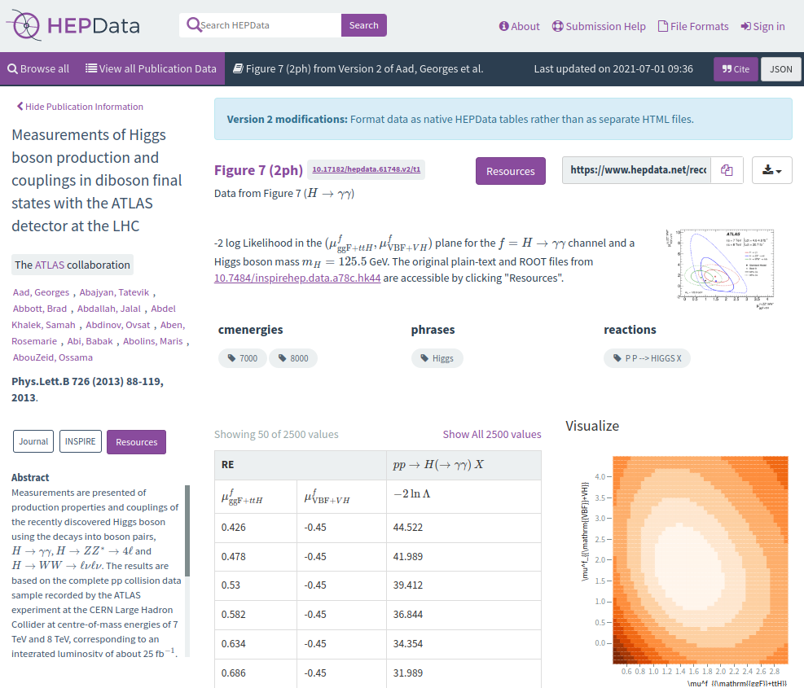](https://www.hepdata.net/record/106539)]
]

---
<!-- Slide N -->
# Historical Overview

.kol-1-2[
- .bold[2000]: Likelihood publishing recommended at [1st Workshop on Confidence Limits, CERN](http://inspirehep.net/record/534129)
- .bold[2012]: Public likelihood functions requested in [Les Houches Recommendations](https://inspirehep.net/literature/1093520)
- .bold[2013]: ATLAS publishes likelihood scan RooFit Workspaces to HEPData
- .bold[2017]: CMS PUB note on simplified likelihood for reinterpretation
]
.kol-1-2[
  
.width-100[[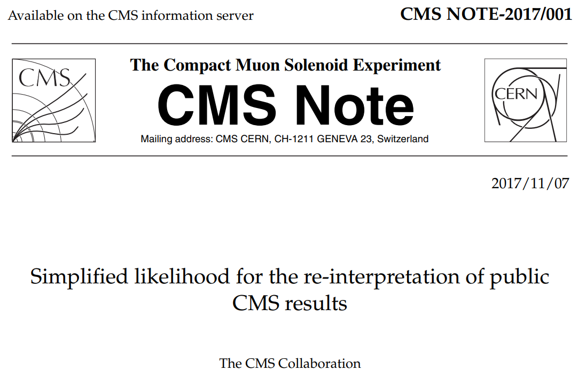](https://cds.cern.ch/record/2242860/)]
]

---
<!-- Slide N -->
# Historical Overview

.kol-1-2[
- .bold[2000]: Likelihood publishing recommended at [1st Workshop on Confidence Limits, CERN](http://inspirehep.net/record/534129)
- .bold[2012]: Public likelihood functions requested in [Les Houches Recommendations](https://inspirehep.net/literature/1093520)
- .bold[2013]: ATLAS publishes likelihood scan RooFit Workspaces to HEPData
- .bold[2017]: CMS PUB note on simplified likelihood for reinterpretation
- .bold[2019]: First full statistical models published to HEPData for ATLAS SUSY analysis
]
.kol-1-2[
  
.width-100[[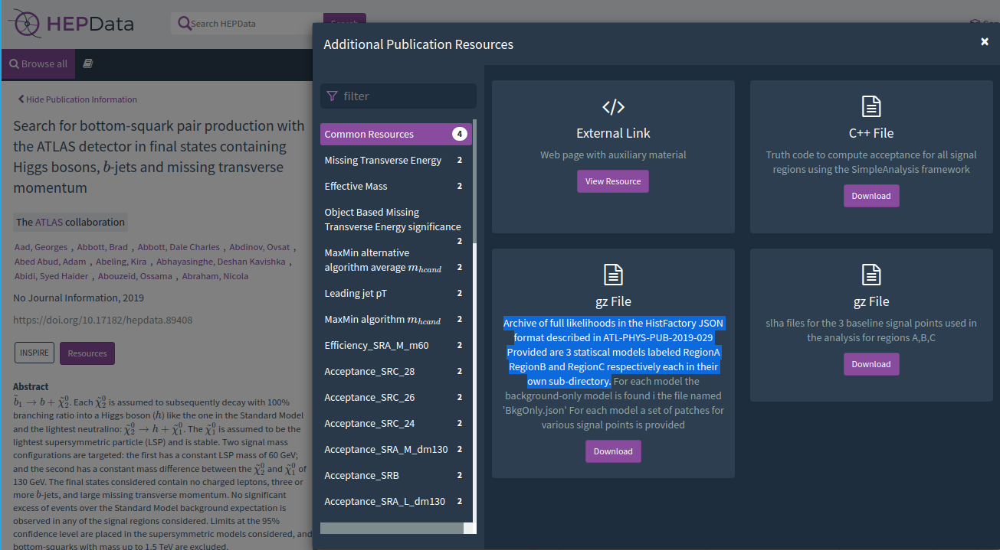](https://www.hepdata.net/record/ins1748602)]
]

---
<!-- Slide N -->
# Historical Overview

.kol-1-2[
- .bold[2000]: Likelihood publishing recommended at [1st Workshop on Confidence Limits, CERN](http://inspirehep.net/record/534129)
- .bold[2012]: Public likelihood functions requested in [Les Houches Recommendations](https://inspirehep.net/literature/1093520)
- .bold[2013]: ATLAS publishes likelihood scan RooFit Workspaces to HEPData
- .bold[2017]: CMS PUB note on simplified likelihood for reinterpretation
- .bold[2019]: First full statistical models published to HEPData for ATLAS SUSY analysis
- .bold[2019]: ATLAS PUB Note on publishing full statistical models using pyhf's JSON schema for HistFactory
]
.kol-1-2[
  
.width-100[[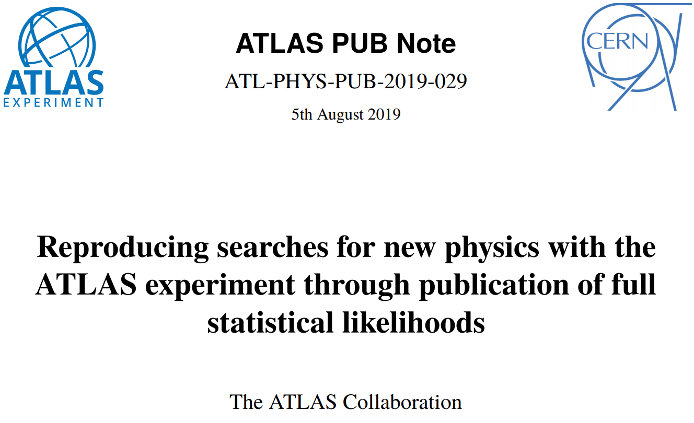](https://inspirehep.net/literature/1795223)]
]

---
<!-- Slide N -->
# Historical Overview

.kol-1-2[
- .bold[2000]: Likelihood publishing recommended at [1st Workshop on Confidence Limits, CERN](http://inspirehep.net/record/534129)
- .bold[2012]: Public likelihood functions requested in [Les Houches Recommendations](https://inspirehep.net/literature/1093520)
- .bold[2013]: ATLAS publishes likelihood scan RooFit Workspaces to HEPData
- .bold[2017]: CMS PUB note on simplified likelihood for reinterpretation
- .bold[2019]: First full statistical models published to HEPData for ATLAS SUSY analysis
- .bold[2019]: ATLAS PUB Note on publishing full statistical models using pyhf's JSON schema for HistFactory
- .bold[2020]: Reinterpretation forum advocates for full statistical models in [Status and Recommendations after Run 2 paper](https://inspirehep.net/literature/1785921)
]
.kol-1-2[
  
.width-100[[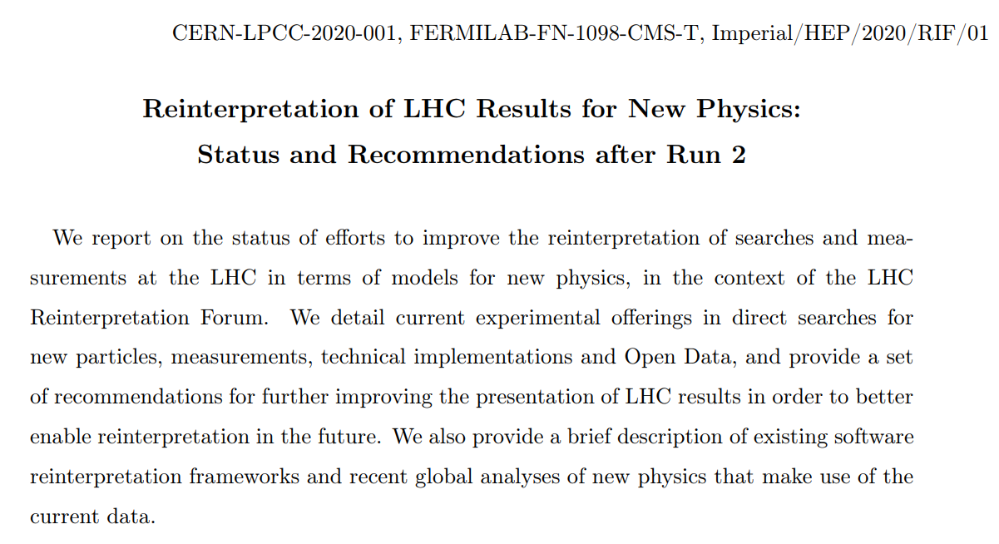](https://inspirehep.net/literature/1785921)]
]

---
<!-- Slide N -->
# Historical Overview

.kol-1-2.small[
- .bold[2000]: Likelihood publishing recommended at [1st Workshop on Confidence Limits, CERN](http://inspirehep.net/record/534129)
- .bold[2012]: Public likelihood functions requested in [Les Houches Recommendations](https://inspirehep.net/literature/1093520)
- .bold[2013]: ATLAS publishes likelihood scan RooFit Workspaces to HEPData
- .bold[2017]: CMS PUB note on simplified likelihood for reinterpretation
- .bold[2019]: First full statistical models published to HEPData for ATLAS SUSY analysis
- .bold[2019]: ATLAS PUB Note on publishing full statistical models using pyhf's JSON schema for HistFactory
- .bold[2020]: Reinterpretation forum advocates for full statistical models in [Status and Recommendations after Run 2 paper](https://inspirehep.net/literature/1785921)
- .bold[2020]: SModelS publishes comparison of simplified models to full statistical models
]
.kol-1-2[
  
.width-100[]

[Feedback on use of public Likelihoods](https://indico.cern.ch/event/957797/contributions/4026032/), Sabine Kraml
(ATLAS Exotics + SUSY Reinterpretations Workshop)
]

---
<!-- Slide N -->
# Historical Overview

.kol-1-2.small[
- .bold[2000]: Likelihood publishing recommended at [1st Workshop on Confidence Limits, CERN](http://inspirehep.net/record/534129)
- .bold[2012]: Public likelihood functions requested in [Les Houches Recommendations](https://inspirehep.net/literature/1093520)
- .bold[2013]: ATLAS publishes likelihood scan RooFit Workspaces to HEPData
- .bold[2017]: CMS PUB note on simplified likelihood for reinterpretation
- .bold[2019]: First full statistical models published to HEPData for ATLAS SUSY analysis
- .bold[2019]: ATLAS PUB Note on publishing full statistical models using pyhf's JSON schema for HistFactory
- .bold[2020]: Reinterpretation forum advocates for full statistical models in [Status and Recommendations after Run 2 paper](https://inspirehep.net/literature/1785921)
- .bold[2020]: SModelS publishes comparison of simplified models to full statistical models
- .bold[2021]: Publishing statistical models recommendations paper
]
.kol-1-2[
  
.width-100[[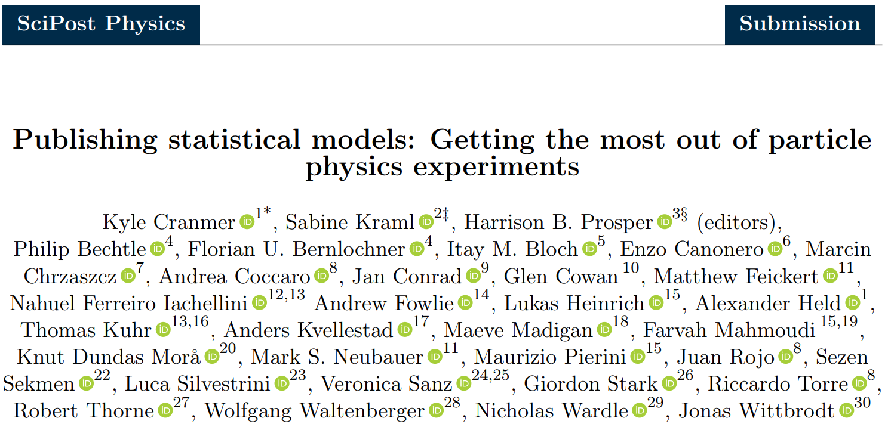](https://inspirehep.net/literature/1919763)]
]

---
<!-- Slide N -->
# Historical Overview

.kol-1-2.small[
- .bold[2000]: Likelihood publishing recommended at [1st Workshop on Confidence Limits, CERN](http://inspirehep.net/record/534129)
- .bold[2012]: Public likelihood functions requested in [Les Houches Recommendations](https://inspirehep.net/literature/1093520)
- .bold[2013]: ATLAS publishes likelihood scan RooFit Workspaces to HEPData
- .bold[2017]: CMS PUB note on simplified likelihood for reinterpretation
- .bold[2019]: First full statistical models published to HEPData for ATLAS SUSY analysis
- .bold[2019]: ATLAS PUB Note on publishing full statistical models using pyhf's JSON schema for HistFactory
- .bold[2020]: Reinterpretation forum advocates for full statistical models in [Status and Recommendations after Run 2 paper](https://inspirehep.net/literature/1785921)
- .bold[2020]: SModelS publishes comparison of simplified models to full statistical models
- .bold[2021]: Publishing statistical models recommendations paper
- .bold[2022]: Snowmass 2022 white paper and COMPF07 recommendations
]
.kol-1-2[
 
.width-100[[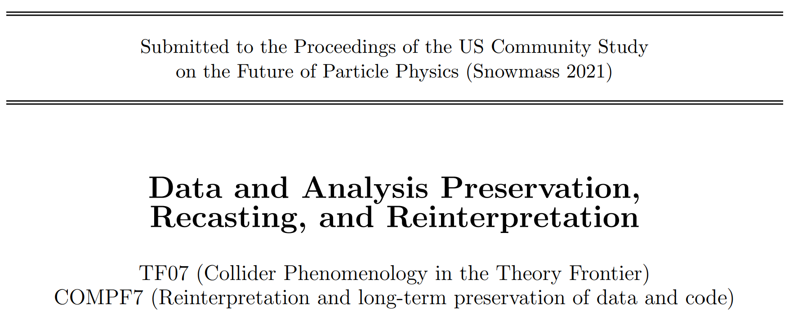](https://inspirehep.net/literature/2054747)]

.width-100[[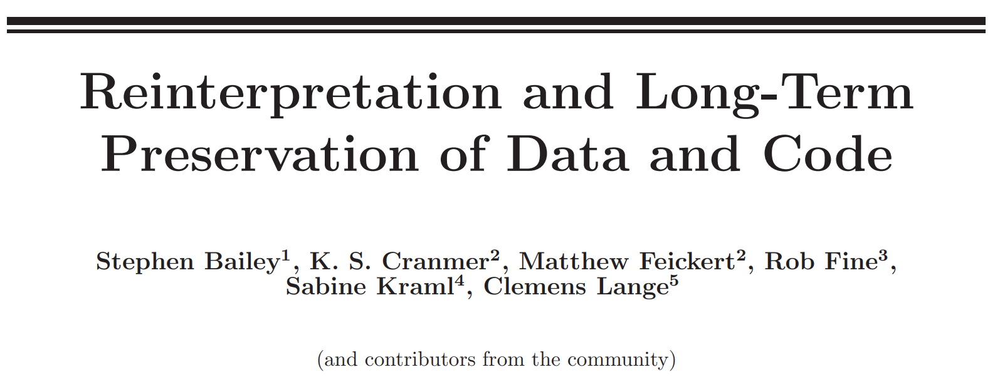](https://inspirehep.net/literature/2153139)]
]

---
# Summary
.kol-2-3.huge[
- Build community practices on top of .bold[established standards]
   <!-- - There are professional communities at work building tools, so we should join them, not rebuild a wheel -->
- If citation of your software is important to you, .bold[make it easy] for a user to find your citation information
- Modern standards like `CITATION.cff` allow for .bold[single source of citation information] that can be exported as needed
- Long term archives + [FAIR practices](https://indico.cern.ch/event/1211229/contributions/5120857/)
   - Zenodo provides automatically release information each release
]
.kol-1-3[
.center.width-80[]

.center.width-100[]
]

---
class: end-slide, center

.huge[Backup]

---
# Does any of this actually work?

As mentioned, these opinions have been formed from developing pyhf, and the citation count for the [JOSS paper](https://doi.org/10.21105/joss.02823) has increased each year.

.center.width-100[]

---

class: end-slide, center
count: false

The end.
